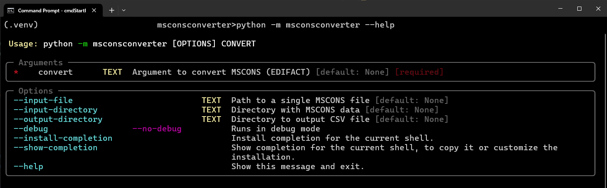

## About

Converts MSCONS (EDIFACT) to CSV.

## Installation (TestPyPI)

```
pip install --index-url https://test.pypi.org/simple/ --upgrade msconsconverter
```

## Usage: CLI

```
python -m msconsconverter convert --input-directory tests/data --output-directory tests/data/output
```
* Convert by providing a directory with data as input in a verbose/debug mode
```
python -m msconsconverter convert --debug --input-directory tests/data --output-directory tests/data/output
```
* Convert by providing a file with data as input in a verbose/debug mode
```
python -m msconsconverter convert --debug --input-file tests/data/MSCONS_TL_SAMPLE01.txt --output-directory tests/data/output
```
* Get help
```
python -m msconsconverter convert --help
```

## Usage: CLI --help example




## Development: HowTo

#### Dependencies: Overview

* Python > 3.7
* requirements.txt

#### Dependencies: Clone and Install Dependencies

* Clone repo
```
git clone https://github.com/vdmitriyev/msconsconverter
```
* Install dependencies or use ```scripts/cmdInitiateEnv.bat```
```
pip install -r requirements.txt
pip install -r requirements-dev.txt
```

#### Run Tests

```
python -m pytest -s
```

## Materials on MSCONS (EDIFACT)

* [EDIFACT - English](https://en.wikipedia.org/wiki/EDIFACT)
* [EDIFACT - German](https://de.wikipedia.org/wiki/EDIFACT)
* [EDI@Energy MSCONS](https://www.edi-energy.de/index.php?id=38) -> format description, see "Bewegungsdaten" section
* http://www.edi-energy.de/
* [Various Usages](https://www.bundesnetzagentur.de/DE/Service-Funktionen/Beschlusskammern/Beschlusskammer6/BK6_31_GPKE_und_GeLiGas/BK6_GPKE_undGeLi_Gas_node.html) -> see "GPKE" section


## License

MIT License
